# Class09: Candy Mini Project
Areidy Arroyo (A17412951)

- [Background](#background)
- [Data Import](#data-import)
- [Exploratory analysis](#exploratory-analysis)
- [Overall Candy Rankings](#overall-candy-rankings)
- [Time for some color](#time-for-some-color)
- [Taking a look at pricepercent](#taking-a-look-at-pricepercent)
- [Exploring the correlation
  structure](#exploring-the-correlation-structure)
- [Principal Component Analysis](#principal-component-analysis)
- [Summary](#summary)

## Background

In today’s mini project we will analyze candy data with exploratory
graphics, basic statistics, correlation analysis, and principal
component analysis methods we have been learning this far.

## Data Import

The data comes as a CSV file from 538

``` r
candy <- read.csv("candy-data.csv", row.names = 1)
  head(candy)
```

                 chocolate fruity caramel peanutyalmondy nougat crispedricewafer
    100 Grand            1      0       1              0      0                1
    3 Musketeers         1      0       0              0      1                0
    One dime             0      0       0              0      0                0
    One quarter          0      0       0              0      0                0
    Air Heads            0      1       0              0      0                0
    Almond Joy           1      0       0              1      0                0
                 hard bar pluribus sugarpercent pricepercent winpercent
    100 Grand       0   1        0        0.732        0.860   66.97173
    3 Musketeers    0   1        0        0.604        0.511   67.60294
    One dime        0   0        0        0.011        0.116   32.26109
    One quarter     0   0        0        0.011        0.511   46.11650
    Air Heads       0   0        0        0.906        0.511   52.34146
    Almond Joy      0   1        0        0.465        0.767   50.34755

> Q1. How many different candy types are in this dataset?

There are 85 rows in this dataset

> Q2. How many fruity candy types are in the dataset?

``` r
sum(candy$fruity)
```

    [1] 38

> Q3. What is your favorite candy (other than Twix) in the dataset and
> what is it’s winpercent value?

``` r
candy["Almond Joy", "winpercent"]
```

    [1] 50.34755

> Q4. What is the winpercent value for “Kit Kat”?

``` r
candy["Kit Kat", "winpercent"]
```

    [1] 76.7686

> Q5. What is the winpercent value for “Tootsie Roll Snack Bars”?

``` r
candy["Tootsie Roll Snack Bars", "winpercent"]
```

    [1] 49.6535

Install package “skimr”

``` r
library(skimr)
```

``` r
skim(candy)
```

|                                                  |       |
|:-------------------------------------------------|:------|
| Name                                             | candy |
| Number of rows                                   | 85    |
| Number of columns                                | 12    |
| \_\_\_\_\_\_\_\_\_\_\_\_\_\_\_\_\_\_\_\_\_\_\_   |       |
| Column type frequency:                           |       |
| numeric                                          | 12    |
| \_\_\_\_\_\_\_\_\_\_\_\_\_\_\_\_\_\_\_\_\_\_\_\_ |       |
| Group variables                                  | None  |

Data summary

**Variable type: numeric**

| skim_variable | n_missing | complete_rate | mean | sd | p0 | p25 | p50 | p75 | p100 | hist |
|:---|---:|---:|---:|---:|---:|---:|---:|---:|---:|:---|
| chocolate | 0 | 1 | 0.44 | 0.50 | 0.00 | 0.00 | 0.00 | 1.00 | 1.00 | ▇▁▁▁▆ |
| fruity | 0 | 1 | 0.45 | 0.50 | 0.00 | 0.00 | 0.00 | 1.00 | 1.00 | ▇▁▁▁▆ |
| caramel | 0 | 1 | 0.16 | 0.37 | 0.00 | 0.00 | 0.00 | 0.00 | 1.00 | ▇▁▁▁▂ |
| peanutyalmondy | 0 | 1 | 0.16 | 0.37 | 0.00 | 0.00 | 0.00 | 0.00 | 1.00 | ▇▁▁▁▂ |
| nougat | 0 | 1 | 0.08 | 0.28 | 0.00 | 0.00 | 0.00 | 0.00 | 1.00 | ▇▁▁▁▁ |
| crispedricewafer | 0 | 1 | 0.08 | 0.28 | 0.00 | 0.00 | 0.00 | 0.00 | 1.00 | ▇▁▁▁▁ |
| hard | 0 | 1 | 0.18 | 0.38 | 0.00 | 0.00 | 0.00 | 0.00 | 1.00 | ▇▁▁▁▂ |
| bar | 0 | 1 | 0.25 | 0.43 | 0.00 | 0.00 | 0.00 | 0.00 | 1.00 | ▇▁▁▁▂ |
| pluribus | 0 | 1 | 0.52 | 0.50 | 0.00 | 0.00 | 1.00 | 1.00 | 1.00 | ▇▁▁▁▇ |
| sugarpercent | 0 | 1 | 0.48 | 0.28 | 0.01 | 0.22 | 0.47 | 0.73 | 0.99 | ▇▇▇▇▆ |
| pricepercent | 0 | 1 | 0.47 | 0.29 | 0.01 | 0.26 | 0.47 | 0.65 | 0.98 | ▇▇▇▇▆ |
| winpercent | 0 | 1 | 50.32 | 14.71 | 22.45 | 39.14 | 47.83 | 59.86 | 84.18 | ▃▇▆▅▂ |

> Q6. Is there any variable/column that looks to be on a different scale
> to the majority of the other columns in the dataset?

Winpercent has a different scale in comparison to skimr as seen in the
mean values that are less than 1, ranging from 0.8 to 0.1.

> Q7. What do you think a zero and one represent for the
> candy\$chocolate column?

I believe one represents there is a chocalate and for zero it would
indicate there is no chocolate present.

## Exploratory analysis

> Q8. Plot a histogram of winpercent values using both base R an
> ggplot2.

``` r
hist( candy$winpercent, breaks=20 )
```

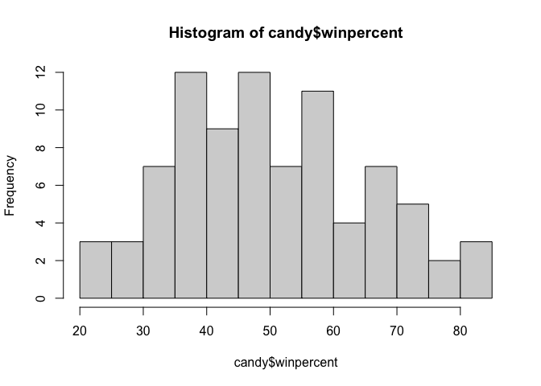

``` r
library(ggplot2)

ggplot(candy) +
  aes(winpercent) +
  geom_histogram(bins=12, fill = "lightblue", col="darkgray")
```


> Q9. Is the distribution of winpercent values symmetrical?

Not symmetrical

> Q10. Is the center of the distribution above or below 50%?

``` r
mean(candy$winpercent)
```

    [1] 50.31676

``` r
summary(candy$winpercent)
```

       Min. 1st Qu.  Median    Mean 3rd Qu.    Max. 
      22.45   39.14   47.83   50.32   59.86   84.18 

``` r
ggplot(candy) +
  aes(winpercent) +
  geom_boxplot()
```

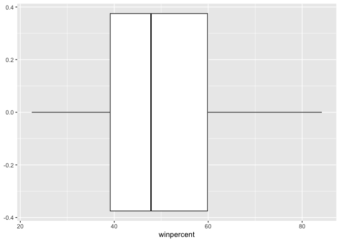

> Q11. On average is chocolate candy higher or lower ranked than fruit
> candy?

Steps to solve this: 1. Find all chocolate candy in the dataset 2.
Extract or find their winpercent values 3. Calculate the mean of these
values

4.  Find all fruit candy
5.  Find their winpercent
6.  Calculate their mean value

``` r
choc.candy <- candy[ candy$chocolate==1, ]
choc.win <- choc.candy$winpercent
mean(choc.win)
```

    [1] 60.92153

``` r
fruit.candy <- candy[ candy$fruity==1, ]
fruit.win <- fruit.candy$winpercent
mean(fruit.win)
```

    [1] 44.11974

Chocolate is ranked higher than fruity as seen in the stats above.
Chocolate had a mean of 60% and fruity had a mean of 44%

> Q12. Is this difference statistically significant?

``` r
t.test(choc.win,fruit.win)
```


        Welch Two Sample t-test

    data:  choc.win and fruit.win
    t = 6.2582, df = 68.882, p-value = 2.871e-08
    alternative hypothesis: true difference in means is not equal to 0
    95 percent confidence interval:
     11.44563 22.15795
    sample estimates:
    mean of x mean of y 
     60.92153  44.11974 

There is no statistically significant difference between the mean values
since the p value is at 2.9e-08, a small value.

## Overall Candy Rankings

> Q13. What are the five least liked candy types in this set?

``` r
inds <- order(candy$winpercent)
head( candy[inds, ], 5)
```

                       chocolate fruity caramel peanutyalmondy nougat
    Nik L Nip                  0      1       0              0      0
    Boston Baked Beans         0      0       0              1      0
    Chiclets                   0      1       0              0      0
    Super Bubble               0      1       0              0      0
    Jawbusters                 0      1       0              0      0
                       crispedricewafer hard bar pluribus sugarpercent pricepercent
    Nik L Nip                         0    0   0        1        0.197        0.976
    Boston Baked Beans                0    0   0        1        0.313        0.511
    Chiclets                          0    0   0        1        0.046        0.325
    Super Bubble                      0    0   0        0        0.162        0.116
    Jawbusters                        0    1   0        1        0.093        0.511
                       winpercent
    Nik L Nip            22.44534
    Boston Baked Beans   23.41782
    Chiclets             24.52499
    Super Bubble         27.30386
    Jawbusters           28.12744

Nik L Nip, Boston Baked Beans, Chiclets, Super Bubble, and Jawbusters.

> Q14. What are the top 5 all time favorite candy types out of this set?

``` r
head(candy[order(candy$winpercent, decreasing = TRUE), ], 5)
```

                              chocolate fruity caramel peanutyalmondy nougat
    Reese's Peanut Butter cup         1      0       0              1      0
    Reese's Miniatures                1      0       0              1      0
    Twix                              1      0       1              0      0
    Kit Kat                           1      0       0              0      0
    Snickers                          1      0       1              1      1
                              crispedricewafer hard bar pluribus sugarpercent
    Reese's Peanut Butter cup                0    0   0        0        0.720
    Reese's Miniatures                       0    0   0        0        0.034
    Twix                                     1    0   1        0        0.546
    Kit Kat                                  1    0   1        0        0.313
    Snickers                                 0    0   1        0        0.546
                              pricepercent winpercent
    Reese's Peanut Butter cup        0.651   84.18029
    Reese's Miniatures               0.279   81.86626
    Twix                             0.906   81.64291
    Kit Kat                          0.511   76.76860
    Snickers                         0.651   76.67378

Reese’s Peanut Butter cup, Reese’s Miniatures, Twix, Kit Kat, and
Snickers.

> Q15. Make a first barplot of candy ranking based on winpercent values.

``` r
ggplot(candy) +
  aes(winpercent, rownames(candy)) +
  geom_col() +
  ylab("") #turn off y-label that we don't need
```


``` r
ggsave("barplot1.png", height=10, width=6)
```


> Q16. This is quite ugly, use the reorder() function to get the bars
> sorted by winpercent?

``` r
ggplot(candy) +
  aes(winpercent, 
      reorder( rownames(candy), winpercent) ) +
  geom_col() +
  ylab("") #turn off y-label that we don't need
```


``` r
ggsave("barplot2.png", height=10, width=6)
```


## Time for some color

I want custom colors that I pick so we need to make this ourselves…

``` r
my_cols <- rep("black", nrow(candy))
my_cols[candy$chocolate==1] <- "lightblue"
my_cols[candy$bar==1]       <- "purple"
my_cols[candy$fruity==1]    <- "magenta"
```

``` r
ggplot(candy) +
aes(winpercent, reorder(rownames(candy), winpercent)) +
geom_col(fill=my_cols) +
ylab("") # turn off Y-label that we don't need
```

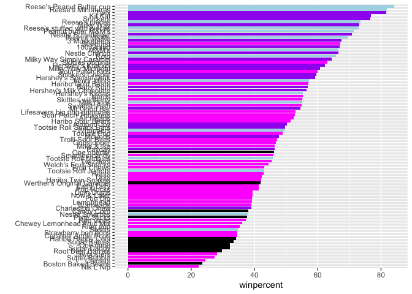

``` r
ggsave("barplot3.png", height=10, width=6)
```

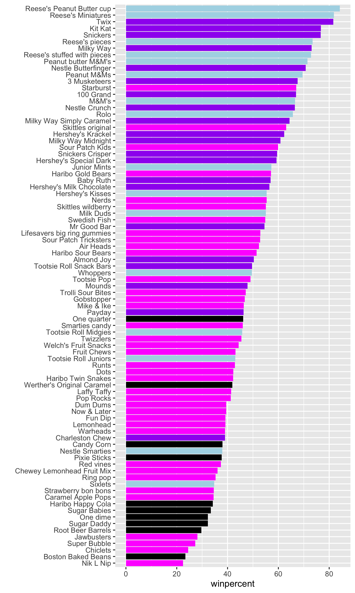

> Q17. What is the worst ranked chocolate candy?

Nik L Nip

> Q18. What is the best ranked fruity candy?

Starburst

## Taking a look at pricepercent

Make a plot if winpercent vs the pricepercent

We can use the **ggrepel** package for better label placement:

``` r
library(ggrepel)

my_cols[candy$fruity==1] <- "red"

ggplot(candy) +
  aes(x=winpercent, y=pricepercent, label=rownames(candy)) +
  geom_point(col=my_cols) +
  geom_text_repel(col = my_cols, size = 3.3, max.overlaps = 5)
```

    Warning: ggrepel: 50 unlabeled data points (too many overlaps). Consider
    increasing max.overlaps

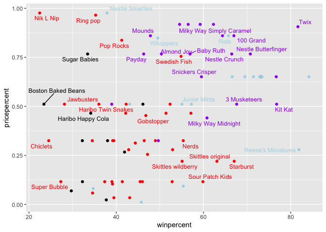

> Q19. Which candy type is the highest ranked in terms of winpercent for
> the least money - i.e. offers the most bang for your buck?

``` r
candy$value <- candy$winpercent / candy$pricepercent
candy[which.max(candy$value), ]
```

                         chocolate fruity caramel peanutyalmondy nougat
    Tootsie Roll Midgies         1      0       0              0      0
                         crispedricewafer hard bar pluribus sugarpercent
    Tootsie Roll Midgies                0    0   0        1        0.174
                         pricepercent winpercent    value
    Tootsie Roll Midgies        0.011   45.73675 4157.886

Tootsie Roll Midgies

> Q20. What are the top 5 most expensive candy types in the dataset and
> of these which is the least popular?

``` r
top_expensive <- candy[order(candy$pricepercent, decreasing = TRUE), ][1:5, ]
top_expensive
```

                             chocolate fruity caramel peanutyalmondy nougat
    Nik L Nip                        0      1       0              0      0
    Nestle Smarties                  1      0       0              0      0
    Ring pop                         0      1       0              0      0
    Hershey's Krackel                1      0       0              0      0
    Hershey's Milk Chocolate         1      0       0              0      0
                             crispedricewafer hard bar pluribus sugarpercent
    Nik L Nip                               0    0   0        1        0.197
    Nestle Smarties                         0    0   0        1        0.267
    Ring pop                                0    1   0        0        0.732
    Hershey's Krackel                       1    0   1        0        0.430
    Hershey's Milk Chocolate                0    0   1        0        0.430
                             pricepercent winpercent    value
    Nik L Nip                       0.976   22.44534 22.99728
    Nestle Smarties                 0.976   37.88719 38.81884
    Ring pop                        0.965   35.29076 36.57073
    Hershey's Krackel               0.918   62.28448 67.84802
    Hershey's Milk Chocolate        0.918   56.49050 61.53649

Nik L Nip, Nestle Smarties, Ring Pop, Hershey’s Krackel, and Hershey’s
Milk Chocolate.

## Exploring the correlation structure

Pearson correlation values range from -1 to +1

``` r
library(corrplot) 
```

    corrplot 0.95 loaded

``` r
cij <- cor(candy)
corrplot(cij)
```

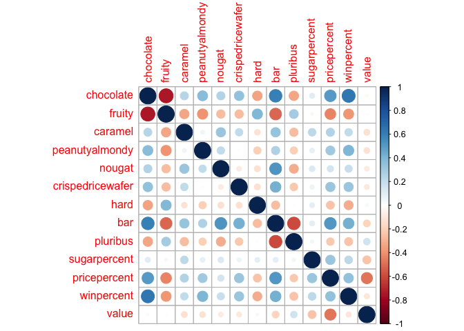

> Q22. Examining this plot what two variables are anti-correlated
> (i.e. have minus values)?

Chocolate and fruity

> Q23. Similarly, what two variables are most positively correlated?

Chocolate and bar

## Principal Component Analysis

``` r
pca <- prcomp(candy, scale=T)
summary(pca)
```

    Importance of components:
                              PC1    PC2     PC3    PC4     PC5     PC6     PC7
    Standard deviation     2.0938 1.2127 1.13054 1.0787 0.98027 0.93656 0.81530
    Proportion of Variance 0.3372 0.1131 0.09832 0.0895 0.07392 0.06747 0.05113
    Cumulative Proportion  0.3372 0.4503 0.54866 0.6382 0.71208 0.77956 0.83069
                               PC8     PC9    PC10    PC11    PC12    PC13
    Standard deviation     0.78462 0.68466 0.66328 0.57829 0.43128 0.39534
    Proportion of Variance 0.04736 0.03606 0.03384 0.02572 0.01431 0.01202
    Cumulative Proportion  0.87804 0.91410 0.94794 0.97367 0.98798 1.00000

``` r
plot(pca$x[, 1:2])
```

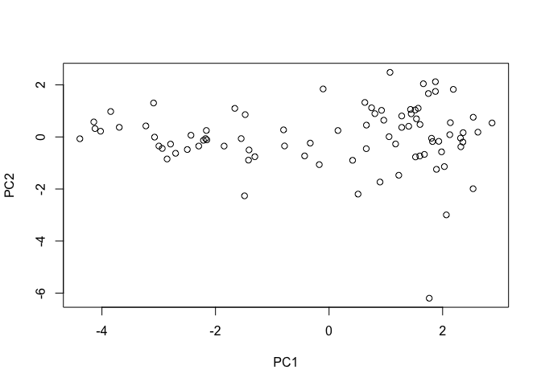

``` r
plot(pca$x[,1:2], col=my_cols, pch=16)
```

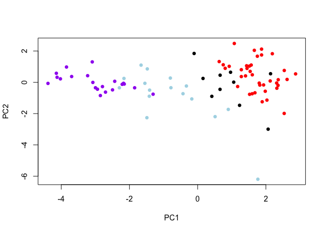

``` r
my_data <- cbind(candy,pca$x[, 1:3])
p <- ggplot(my_data) +
aes(x = PC1, y = PC2,
size = winpercent/100,
text = rownames(my_data),
label = rownames(my_data)) +
geom_point(col = my_cols)
p
```

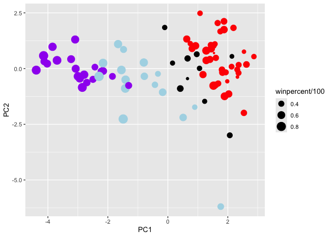

The main results figure: the PCA score plot:

``` r
ggplot(pca$x) +
  aes(PC1, PC2, label=rownames(pca$x)) +
  geom_point(col=my_cols) +
  geom_text_repel(col=my_cols) +
  labs(title="PCA Candy Space Map")
```

    Warning: ggrepel: 53 unlabeled data points (too many overlaps). Consider
    increasing max.overlaps

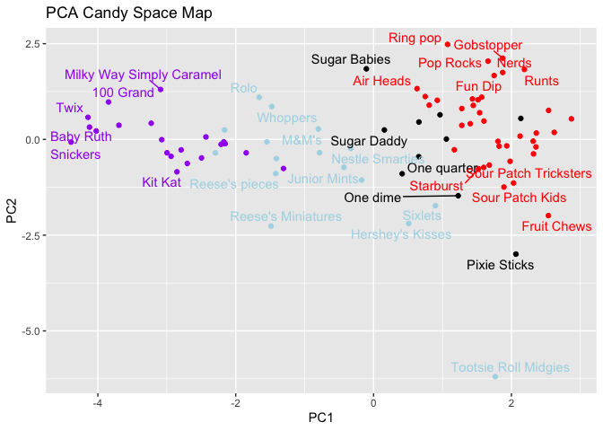

The “loadings”plot for PC1

``` r
ggplot(pca$rotation) +
  aes(PC1, 
      reorder( rownames(pca$rotation), PC1) ) +
  geom_col() +
  ylab("")
```

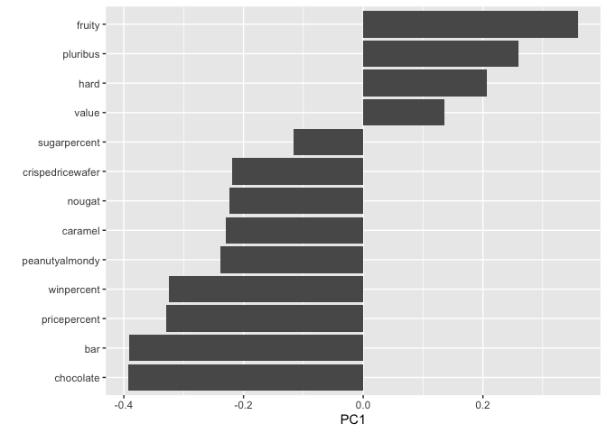

> Q24. Complete the code to generate the loadings plot above. What
> original variables are picked up strongly by PC1 in the positive
> direction? Do these make sense to you? Where did you see this
> relationship highlighted previously?

PC1 is dominant in comparison to the others due to its strong and large
variables. In which these values are able to be expressed in the plots
after its consistency. As variability increases so does PC1, making this
a positive value.

## Summary

> Q25. Based on your exploratory analysis, correlation findings, and PCA
> results, what combination of characteristics appears to make a
> “winning” candy? How do these different analyses (visualization,
> correlation, PCA) support or complement each other in reaching this
> conclusion?

Based of the data found today the winning candy would be chocolate candy
due to its larger mean value. Positively correlated win percentages
would be considered the chocolate and sugared candies, according to PC1
scores and other plot graphs provided throughout the lab,
