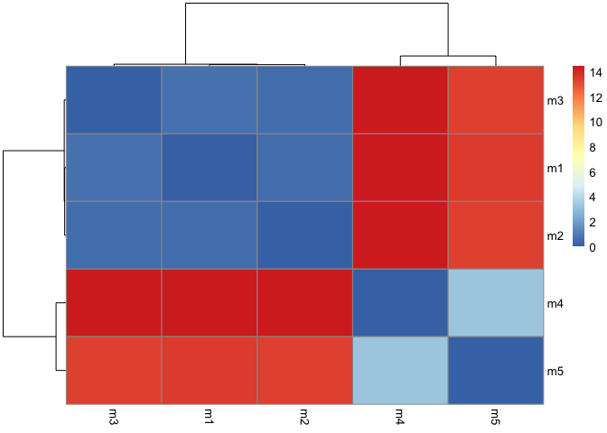
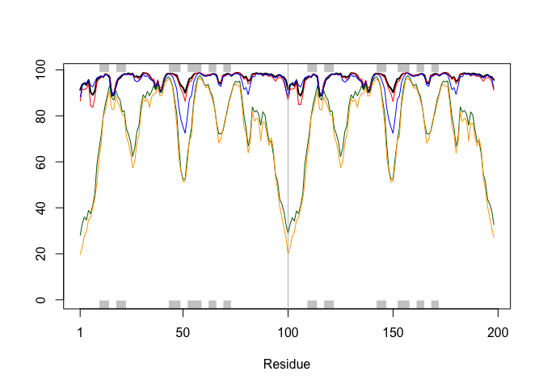
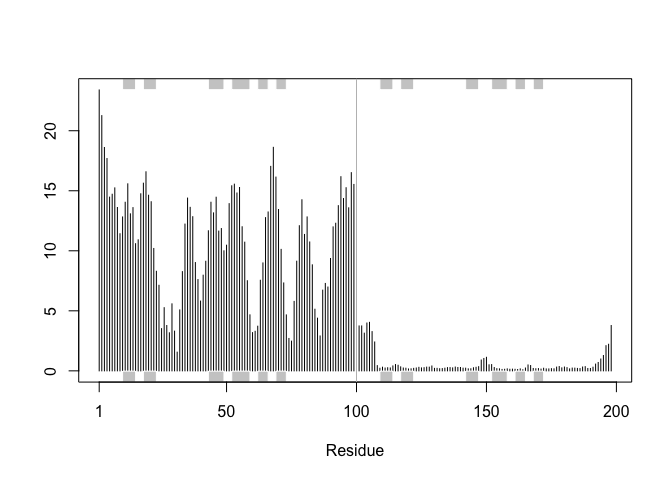
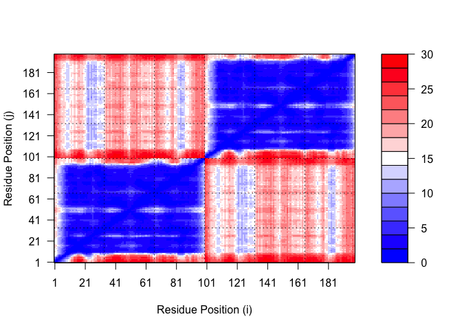
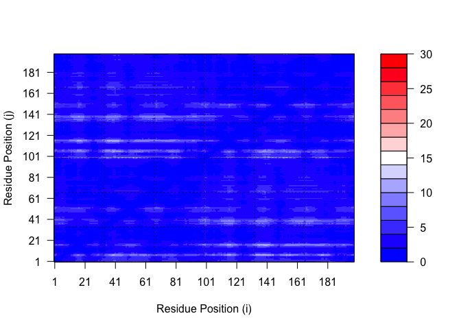
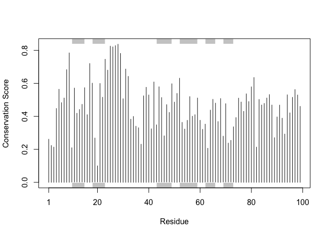

# Class 11: AlphaFold
Areidy Arroyo A17412951

- [Background](#background)
- [EBI AlphaFold Database](#ebi-alphafold-database)
- [Running AlphaFold](#running-alphafold)
- [Custom analysis of resulting
  models](#custom-analysis-of-resulting-models)
- [Predicted Alignment Error for
  domains](#predicted-alignment-error-for-domains)
- [Residue conservation from alignment
  file](#residue-conservation-from-alignment-file)

## Background

In this hands-on session we will utilize AlphaFold to predict protein
structure from sequence.

Without the aid of such approaches, it can take years of expensive
laboratory work to determine the structure of just one protein. With
AlphaFold we can now accurately compute a typical protein structure in
as little as ten minutes.

The PDB database (the main repository of experimental structures) only
has **~250 thousand** structures (we saw this in the last lab). The main
protein sequence database over **200 million** sequences! Only 0.125% of
known sequences have known structure - this is called the “structure
knowledge gap”.

``` r
(250000 / 200000000 ) *100
```

    [1] 0.125

- Structures are much harder to determine than sequences
- They are expensive (on average ~\$1 million each)
- They take on average 3-5 years to solve!

## EBI AlphaFold Database

The EBI has a database of pre-computed ALphaFold (AF) models called
AFDB. This is growing overtime and can be useful to check before running
AF ourselves

## Running AlphaFold

We can download and run locally (on our own computers) but we need a
GPU. Or we can use “cloud” computing to run this on someone elses
computers :-)

We will use ColabFold \< https://github.com/sokrypton/ColabFold \>

We previously found there was no AFDB entry for our HIV sequence:

    >HIV-Pr-Dimer
    PQITLWQRPLVTIKIGGQLKEALLDTGADDTVLEEMSLPGRWKPKMIGGIGGFIKVRQYDQILIEICGHKAIGTVLVGPTPVNIIGRNLLTQIGCTLNF:PQITLWQRPLVTIKIGGQLKEALLDTGADDTVLEEMSLPGRWKPKMIGGIGGFIKVRQYDQILIEICGHKAIGTVLVGPTPVNIIGRNLLTQIGCTLNF

Here we will use AlphaFold2_mmseqs2

## Custom analysis of resulting models

We will move our AlphaFold results into RStudio

``` r
results_dir <- "hivpr_23119/" 
```

``` r
pdb_files <- list.files(path=results_dir,
                        pattern="*.pdb",
                        full.names = TRUE)
basename(pdb_files)
```

    [1] "hivpr_23119_unrelaxed_rank_001_alphafold2_multimer_v3_model_4_seed_000.pdb"
    [2] "hivpr_23119_unrelaxed_rank_002_alphafold2_multimer_v3_model_1_seed_000.pdb"
    [3] "hivpr_23119_unrelaxed_rank_003_alphafold2_multimer_v3_model_5_seed_000.pdb"
    [4] "hivpr_23119_unrelaxed_rank_004_alphafold2_multimer_v3_model_2_seed_000.pdb"
    [5] "hivpr_23119_unrelaxed_rank_005_alphafold2_multimer_v3_model_3_seed_000.pdb"

Here we will see the model sequences and all its alignments

``` r
library(bio3d)

# Read all data from Models 
#  and superpose/fit coords
pdbs <- pdbaln(pdb_files, fit=TRUE, exefile="msa")
```

    Reading PDB files:
    hivpr_23119//hivpr_23119_unrelaxed_rank_001_alphafold2_multimer_v3_model_4_seed_000.pdb
    hivpr_23119//hivpr_23119_unrelaxed_rank_002_alphafold2_multimer_v3_model_1_seed_000.pdb
    hivpr_23119//hivpr_23119_unrelaxed_rank_003_alphafold2_multimer_v3_model_5_seed_000.pdb
    hivpr_23119//hivpr_23119_unrelaxed_rank_004_alphafold2_multimer_v3_model_2_seed_000.pdb
    hivpr_23119//hivpr_23119_unrelaxed_rank_005_alphafold2_multimer_v3_model_3_seed_000.pdb
    .....

    Extracting sequences

    pdb/seq: 1   name: hivpr_23119//hivpr_23119_unrelaxed_rank_001_alphafold2_multimer_v3_model_4_seed_000.pdb 
    pdb/seq: 2   name: hivpr_23119//hivpr_23119_unrelaxed_rank_002_alphafold2_multimer_v3_model_1_seed_000.pdb 
    pdb/seq: 3   name: hivpr_23119//hivpr_23119_unrelaxed_rank_003_alphafold2_multimer_v3_model_5_seed_000.pdb 
    pdb/seq: 4   name: hivpr_23119//hivpr_23119_unrelaxed_rank_004_alphafold2_multimer_v3_model_2_seed_000.pdb 
    pdb/seq: 5   name: hivpr_23119//hivpr_23119_unrelaxed_rank_005_alphafold2_multimer_v3_model_3_seed_000.pdb 

We will now calculate the structural distance betwee coordinate sets
using RMSD

``` r
rd <- rmsd(pdbs, fit=T)
```

    Warning in rmsd(pdbs, fit = T): No indices provided, using the 198 non NA positions

``` r
range(rd)
```

    [1]  0.000 14.457

Create a pheatmap of these coordinates

``` r
library(pheatmap)

colnames(rd) <- paste0("m",1:5)
rownames(rd) <- paste0("m",1:5)
pheatmap(rd)
```



We can now plot the pLDDT values into a PDB files and add our desired
colors into the graph

``` r
pdb <- read.pdb("1hsg")
```

      Note: Accessing on-line PDB file

``` r
plotb3(pdbs$b[1,], typ="l", lwd=2, sse=pdb)
points(pdbs$b[2,], typ="l", col="red")
points(pdbs$b[3,], typ="l", col="blue")
points(pdbs$b[4,], typ="l", col="darkgreen")
points(pdbs$b[5,], typ="l", col="orange")
abline(v=100, col="gray")
```



Fix the superposition of the model creating a rigid core using
`core.find()`

``` r
core <-core.find(pdbs)
```

     core size 197 of 198  vol = 5754.474 
     core size 196 of 198  vol = 4572.526 
     core size 195 of 198  vol = 2115.143 
     core size 194 of 198  vol = 1525.93 
     core size 193 of 198  vol = 1390.829 
     core size 192 of 198  vol = 1280.595 
     core size 191 of 198  vol = 1171.652 
     core size 190 of 198  vol = 1082.83 
     core size 189 of 198  vol = 1047.706 
     core size 188 of 198  vol = 1021.701 
     core size 187 of 198  vol = 1001.511 
     core size 186 of 198  vol = 982.408 
     core size 185 of 198  vol = 965.11 
     core size 184 of 198  vol = 945.291 
     core size 183 of 198  vol = 922.93 
     core size 182 of 198  vol = 879.676 
     core size 181 of 198  vol = 856.189 
     core size 180 of 198  vol = 811.173 
     core size 179 of 198  vol = 789.408 
     core size 178 of 198  vol = 764.613 
     core size 177 of 198  vol = 743.895 
     core size 176 of 198  vol = 720.032 
     core size 175 of 198  vol = 699.404 
     core size 174 of 198  vol = 679.546 
     core size 173 of 198  vol = 662.076 
     core size 172 of 198  vol = 640.751 
     core size 171 of 198  vol = 619.091 
     core size 170 of 198  vol = 600.089 
     core size 169 of 198  vol = 582.484 
     core size 168 of 198  vol = 560.512 
     core size 167 of 198  vol = 526.05 
     core size 166 of 198  vol = 494.758 
     core size 165 of 198  vol = 477.336 
     core size 164 of 198  vol = 459.201 
     core size 163 of 198  vol = 444.277 
     core size 162 of 198  vol = 428.758 
     core size 161 of 198  vol = 415.985 
     core size 160 of 198  vol = 401.762 
     core size 159 of 198  vol = 385.62 
     core size 158 of 198  vol = 371.755 
     core size 157 of 198  vol = 357.766 
     core size 156 of 198  vol = 345.196 
     core size 155 of 198  vol = 331.481 
     core size 154 of 198  vol = 317.372 
     core size 153 of 198  vol = 303.658 
     core size 152 of 198  vol = 291.234 
     core size 151 of 198  vol = 276.942 
     core size 150 of 198  vol = 265.069 
     core size 149 of 198  vol = 254.695 
     core size 148 of 198  vol = 244.929 
     core size 147 of 198  vol = 234.256 
     core size 146 of 198  vol = 223.932 
     core size 145 of 198  vol = 214.812 
     core size 144 of 198  vol = 204.565 
     core size 143 of 198  vol = 196.615 
     core size 142 of 198  vol = 182.849 
     core size 141 of 198  vol = 173.456 
     core size 140 of 198  vol = 166.316 
     core size 139 of 198  vol = 157.971 
     core size 138 of 198  vol = 151.565 
     core size 137 of 198  vol = 145.31 
     core size 136 of 198  vol = 139.486 
     core size 135 of 198  vol = 133.291 
     core size 134 of 198  vol = 127.405 
     core size 133 of 198  vol = 121.952 
     core size 132 of 198  vol = 116.445 
     core size 131 of 198  vol = 108.879 
     core size 130 of 198  vol = 102.219 
     core size 129 of 198  vol = 94.88 
     core size 128 of 198  vol = 88.654 
     core size 127 of 198  vol = 83.357 
     core size 126 of 198  vol = 79.603 
     core size 125 of 198  vol = 77.313 
     core size 124 of 198  vol = 74.084 
     core size 123 of 198  vol = 70.385 
     core size 122 of 198  vol = 66.687 
     core size 121 of 198  vol = 62.458 
     core size 120 of 198  vol = 59.279 
     core size 119 of 198  vol = 56.355 
     core size 118 of 198  vol = 53.213 
     core size 117 of 198  vol = 49.293 
     core size 116 of 198  vol = 46.5 
     core size 115 of 198  vol = 42.868 
     core size 114 of 198  vol = 39.993 
     core size 113 of 198  vol = 36.701 
     core size 112 of 198  vol = 34.827 
     core size 111 of 198  vol = 32.668 
     core size 110 of 198  vol = 29.561 
     core size 109 of 198  vol = 26.953 
     core size 108 of 198  vol = 24.475 
     core size 107 of 198  vol = 21.998 
     core size 106 of 198  vol = 20.512 
     core size 105 of 198  vol = 18.384 
     core size 104 of 198  vol = 16.871 
     core size 103 of 198  vol = 14.911 
     core size 102 of 198  vol = 13.128 
     core size 101 of 198  vol = 11.113 
     core size 100 of 198  vol = 9.381 
     core size 99 of 198  vol = 7.991 
     core size 98 of 198  vol = 6.99 
     core size 97 of 198  vol = 6.059 
     core size 96 of 198  vol = 5.128 
     core size 95 of 198  vol = 4.231 
     core size 94 of 198  vol = 3.692 
     core size 93 of 198  vol = 3.126 
     core size 92 of 198  vol = 2.754 
     core size 91 of 198  vol = 2.271 
     core size 90 of 198  vol = 1.642 
     core size 89 of 198  vol = 1.065 
     core size 88 of 198  vol = 0.644 
     core size 87 of 198  vol = 0.444 
     FINISHED: Min vol ( 0.5 ) reached

``` r
core.inds <- print(core, vol=0.5)
```

    # 88 positions (cumulative volume <= 0.5 Angstrom^3) 
      start end length
    1     8  95     88

``` r
xyz <- pdbfit(pdbs, core.inds, outpath="corefit_structures")
```

Now that we have superposed coordinates we can open our structure from
Mol\*

Here we will examine RMSF and its positions

``` r
rf <- rmsf(xyz)

plotb3(rf, sse=pdb)
abline(v=100, col="gray", ylab="RMSF")
```



## Predicted Alignment Error for domains

Read files and predict alignment error for domains using `jsonlite()`

``` r
library(jsonlite)

pae_files <- list.files(path=results_dir,
                       pattern=".*model.*\\.json",
                        full.names = TRUE)
```

For example we will read models 1 and 5 here:

``` r
pae1 <- read_json(pae_files[1],simplifyVector = TRUE)
pae5 <- read_json(pae_files[5],simplifyVector = TRUE)

attributes(pae1)
```

    $names
    [1] "plddt"   "max_pae" "pae"     "ptm"     "iptm"   

``` r
head(pae1$plddt) 
```

    [1] 91.31 93.69 94.12 93.38 95.62 90.19

Calculate the max PAE value

``` r
pae1$max_pae
```

    [1] 12.57812

``` r
pae5$max_pae
```

    [1] 29.82812

We can now plot this

``` r
plot.dmat(pae5$pae, 
          xlab="Residue Position (i)",
          ylab="Residue Position (j)",
          grid.col = "black",
          zlim=c(0,30))
```



Now we will plot using the same z range

``` r
plot.dmat(pae1$pae, 
          xlab="Residue Position (i)",
          ylab="Residue Position (j)",
          grid.col = "black",
          zlim=c(0,30))
```



## Residue conservation from alignment file

``` r
aln_file <- list.files(path=results_dir,
                       pattern=".a3m$",
                        full.names = TRUE)
aln_file
```

    [1] "hivpr_23119//hivpr_23119.a3m"

``` r
aln <- read.fasta(aln_file[1], to.upper = TRUE)
```

    [1] " ** Duplicated sequence id's: 101 **"
    [2] " ** Duplicated sequence id's: 101 **"

Calculate how many sequences are in the alignment

``` r
dim(aln$ali)
```

    [1] 5397  132

Use `conserv()` to score the residue conservation

``` r
sim <- conserv(aln)
plotb3(sim[1:99], sse=trim.pdb(pdb, chain="A"),
       ylab="Conservation Score")
```



View parts where there is a high cutoff value in the consensus sequence

``` r
con <- consensus(aln, cutoff = 0.9)
con$seq
```

      [1] "-" "-" "-" "-" "-" "-" "-" "-" "-" "-" "-" "-" "-" "-" "-" "-" "-" "-"
     [19] "-" "-" "-" "-" "-" "-" "D" "T" "G" "A" "-" "-" "-" "-" "-" "-" "-" "-"
     [37] "-" "-" "-" "-" "-" "-" "-" "-" "-" "-" "-" "-" "-" "-" "-" "-" "-" "-"
     [55] "-" "-" "-" "-" "-" "-" "-" "-" "-" "-" "-" "-" "-" "-" "-" "-" "-" "-"
     [73] "-" "-" "-" "-" "-" "-" "-" "-" "-" "-" "-" "-" "-" "-" "-" "-" "-" "-"
     [91] "-" "-" "-" "-" "-" "-" "-" "-" "-" "-" "-" "-" "-" "-" "-" "-" "-" "-"
    [109] "-" "-" "-" "-" "-" "-" "-" "-" "-" "-" "-" "-" "-" "-" "-" "-" "-" "-"
    [127] "-" "-" "-" "-" "-" "-"

``` r
m1.pdb <- read.pdb(pdb_files[1])
occ <- vec2resno(c(sim[1:99], sim[1:99]), m1.pdb$atom$resno)
write.pdb(m1.pdb, o=occ, file="m1_conserv.pdb")
```
