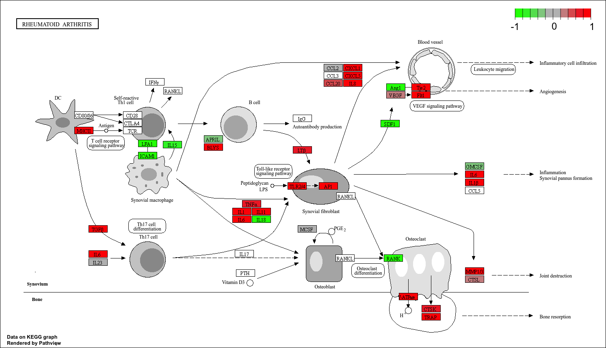

## Background

The data for today's mini-project comes from a study of an important HOX gene.


## Data Import

```{r}
countData <- read.csv("GSE37704_featurecounts.csv", row.names = 1)
colData <- read.csv("GSE37704_metadata.csv", row.names = 1)
```

Let's have a wee peek at these:

```{r}
colData
```

```{r}
head(countData)
```

### Clean up (data tidying)

We need to remove the funny "length" column from our `countData` to make the columns match in the rows in `colData`

```{r}
countData <- countData[, -1]
```

Check match of `colData` and `countData`
```{r}
rownames(colData) == colnames(countData)
```

```{r}
head(countData)
```

```{r}
to.keep <- rowSums(countData) > 0
countData <- countData[to.keep,]
```


## DESeq Analysis

```{r, message=FALSE}
library(DESeq2)
```


### Setting up the DESeq object

```{r}
dds <- DESeqDataSetFromMatrix(countData = countData,
                       colData = colData,
                       design = ~condition)
```

```{r}
colData
```

## Running DESeq

```{r}
dds <- DESeq(dds)
```

```{r}
res <- results(dds)
```


### Getting results

```{r}
res <- results(dds)
head(res)
```

Summary of results

```{r}
res <- results(dds)
summary(res)
```

## Volcano Plot

A plot of log2 fold change vs -log of Adjusted P-Value

```{r}
library(ggplot2)

ggplot(res) +
  aes(log2FoldChange,
      -log(padj)) +
  geom_point()
```
```{r}
ggplot(res) +
  aes(log2FoldChange,
      -log(padj)) +
  geom_point() +
  geom_hline(yintercept = -log(0.01), col = "red")
```
### Add some color

```{r}
mycols <- rep("gray", nrow(res))
mycols[ abs(res$log2FoldChange) >2 ] <- "darkgreen"
mycols[ res$padj >= 0.01] <- "gray"

ggplot(res) +
  aes(log2FoldChange,
      -log(padj)) +
  geom_point(col=mycols) +
  geom_vline(xintercept = c(-2,2) )
  geom_hline(yintercept = -log(0.01))
```


## Add Annotation

```{r}
library(AnnotationDbi)
library(org.Hs.eg.db)
```


```{r}
res$symbol <- mapIds(org.Hs.eg.db,
                     keys = rownames(res),
                     keytype = "ENSEMBL",
                     column = "SYMBOL")

res$entrez <- mapIds(org.Hs.eg.db,
                     keys = rownames(res),
                     keytype = "ENSEMBL",
                     column = "ENTREZID")
head(res)
```

## Pathway Analysis

```{r}
library(gage)
library(gageData)
library(pathview)
```

We need a foldchanges vector for `gage()`

```{r}
foldchanges <- res$log2FoldChange
names(foldchanges) <- res$entrez
```


### KEGG

```{r}
data(kegg.sets.hs)
data(sigmet.idx.hs)
keggres = gage(foldchanges, gsets=kegg.sets.hs)
```

```{r}
head(keggres$less)
```

```{r}
pathview(gene.data=foldchanges, pathway.id="hsa04110")
```


```{r}
## Focus on top 5 upregulated pathways here for demo purposes only
keggrespathways <- rownames(keggres$greater)[1:5]
keggresids = substr(keggrespathways, start=1, stop=8)
keggresids
```

```{r}
pathview(gene.data=foldchanges, pathway.id="hsa04060")
```

```{r}
pathview(gene.data=foldchanges, pathway.id="hsa05323")
```



```{r}
pathview(gene.data=foldchanges, pathway.id="hsa05146")
```

```{r}
pathview(gene.data=foldchanges, pathway.id="hsa05332")
```


```{r}
pathview(gene.data=foldchanges, pathway.id="hsa04640")
```


### GO

```{r}
data(go.sets.hs)
data(go.subs.hs)

# Focus on Biological Process subset of GO
gobpsets = go.sets.hs[go.subs.hs$BP]

gobpres = gage(foldchanges, gsets=gobpsets)

```

```{r}
head(gobpres$less)
```

### Reactome

```{r}
sig_genes <- res[res$padj <= 0.05 & !is.na(res$padj), "symbol"]
write.table(sig_genes, file="significant_genes.txt", row.names=FALSE, col.names=FALSE, quote=FALSE)
```

> Q. What pathway has the most significant “Entities p-value”? Do the most significant pathways listed match your previous KEGG results? What factors could cause differences between the two methods?

The most significant "entities p-value" is cell cycle, mitotic with a p-value of 2.1E-5. The most significant pathways listed to match KEGG results do not match because they have different pathways that results into more/less genes. These two methods can be differentiated through database sources, pathways, genes, etc.
