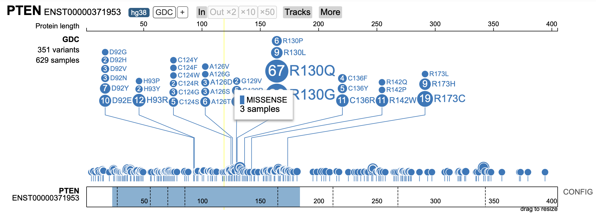

# class19

> Q1.What protein do these sequences correspond to? (Give both full
> gene/protein name and official symbol).

Full protein name: Phosphatidylinositol-3,4,5-trisphosphate
3-phosphatase and dual-specificity protein phosphatase PTEN Official
gene/protein symbol:PTEN

> Q2. What are the tumor specific mutations in this particular case (
> e.g. A130V)?

``` r
library(bio3d)

#Read my sequences
a <- read.fasta("A17412951_mutant_seq.fa")
```

We can score conservation per sequence position

``` r
s <- conserv(a)
mutation.position <- which (s != 1)
mutation.position
```

    [1] 115 126 140 147

``` r
a$ali[1,mutation.position]
```

    [1] "D" "A" "L" "K"

``` r
mutation.position
```

    [1] 115 126 140 147

``` r
a$ali[2,mutation.position]
```

    [1] "V" "E" "R" "Y"

What PFAM domain do these mutations reside in?

We can use HMMER at the ebi to find this information

OR UniProt, InterPro

> Q3. Do your mutations cluster to any particular domain and if so give
> the name and PFAM id of this domain? Alternately note whether your
> protein is single domain and provide it’s PFAM id/accession and name
> (e.g. PF00613 and PI3Ka).

Domain name: PTEN phosphatase domain PFAM ID: PF10409

> Q4. Using the NCI-GDC list the observed top 2 missense mutations in
> this protein (amino acid substitutions)?

R130Q R130G

 \> Q5. What two TCGA projects have the most cases
affected by mutations of this gene? (Give the TCGA “code” and “Project
Name” for example “TCGA-BRCA” and “Breast Invasive Carcinoma”).

TCGA-UCEC — Uterine Corpus Endometrial Carcinoma TCGA-GBM — Glioblastoma
Multiforme

> Q6. List one RCSB PDB identifier with 100% identity to the wt_healthy
> sequence and detail the percent coverage of your query sequence for
> this known structure?

7JVX

> Q7. Using AlphaFold notebook generate a structural model using the
> default parameters for your mutant sequence.
